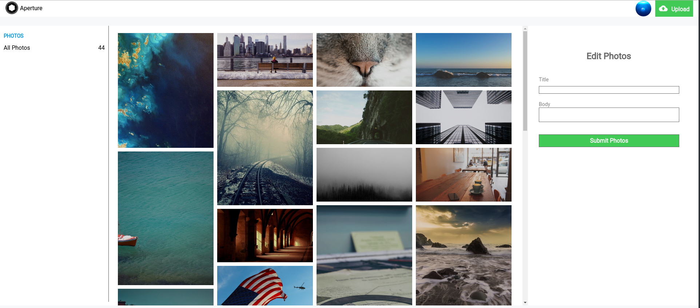

# Aperture

[Aperture Live][heroku]

[heroku]: https://aperture-px.herokuapp.com

Aperture is a photography community web application inspired by 500px. It utilizes a Ruby on Rails backend, a PostgreSQL database, and React.js with Redux on the frontend.


## Features and Implementation

- [User Profiles](#users)
- [Photo Viewing](#photo-viewing)
- [Photo Manipulation](#photo-manipulation)
- [Home Feed](#home-feed)

### Users

Users can sign up or log in to the website. Alternatively, users can opt to sign in with a demo user account to navigate the site.


Users can view their own profile or visit and follow other users. Within each user profile, you may see how many users they're following and how many users follow them. You may also see all of their uploaded photos in a photo grid. This grid is implemented with the Masonry.js library to allow for optimal positioning of images.

```js
$(document).ready(() => {
  var grid = document.querySelector(".photo-grid-contents");

  var msnry = new Masonry(grid, {
    columnWidth: ".photo-grid-sizer",
    gutter: ".photo-gutter-sizer",
    itemSelector: ".photo-grid-item",
    percentPosition: true
  });

  imagesLoaded(grid).on("progress", function() {
    // layout Masonry after each image loads
    msnry.layout();
  });
});
```


### Photo Viewing

Users can view each photo post as a separate modal. The modal contains the photo's title and description as well as a section to add and view comments. In the photo view modal, users can also choose to follow or unfollow other users as well.


### Photo Manipulation

Users can upload multiple photos at once to their profile, which are stored in Amazon Web Services S3 buckets. When uploading photos, users can add a Title and Description for each photo they upload.


The parseFiles method will retrieve all the images and their paths before bringing the user to the upload photos modal where they can add a Title and Description before uploading them to AWS S3.

```js
  parseFiles(file, idx, filesCount) {
    const reader = new FileReader();
    reader.onloadend = () => {
      this.tempPhotoState = this.tempPhotoState.concat( { id: idx, image_url: reader.result, imageFile: file} );

      if(filesCount === this.tempPhotoState.length){
        this.props.openModal({ modalType: 'pre-submit', photos: this.tempPhotoState });
      }
    };

    if (file) {
      reader.readAsDataURL(file);
    }
  }
```

User can also edit their uploaded photos via the _Manage Photos_ page



### Home Feed

Once a user has logged in, they can view their home feed, which is a photo feed of all of their follower's recent photo posts.


## Future Directions

- Infinite scrolling on the home feed to allow for pagination of photos displayed
- Photos will be able to be tagged for specific photo searches
- Users will be able to search for other users and photos
- Google Maps API integration to place photos by where they were taken
- Favoriting photos and building albums
